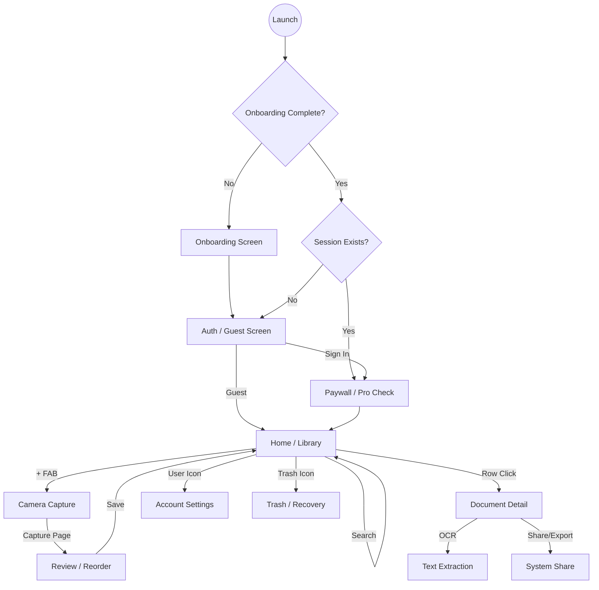

# Recto — Full App Preview & Interface Map

Recto is a high-precision, privacy-first document scanner. Its design is industrial and technical, leaning heavily into a dark "Graphite & Cyan" aesthetic with high-contrast typography.

## 🎨 Visual Identity
- **Primary Color**: `CalibrationCyan (#00D7E8)` — Used for ready states, primary actions, and "ProofCheck" highlights.
- **Secondary Color**: `RegistrationMagenta (#FF2E88)` — Used for errors, tilt warnings, and Pro-tier features.
- **Background**: `Graphite (#101315)` & `Ink (#171B1E)` — A deep, non-pure-black theme.
- **Typography**: Heavy, bold Sans-Serif headings paired with Monospace labels for a "technical equipment" feel.

---

## 🗺️ Navigation & Flow

---

## 🖼️ Screen Gallery (Descriptions)

### 1. Home Screen (The Library)
- **Header**: Large "Paper, measured." headline with a Monospace "RECTO" eyebrow.
- **ProofCheck Hero**: A prominent circular gauge showing the current "Quality Gate" score (94-98). It feels like a piece of calibrated hardware.
- **Quick Actions**: Two large tiles for "SCAN CODE" and "IMPORT".
- **Document List**: Elegant rows showing a thumbnail placeholder, the document title, and a technical detail string (e.g., `1P · Q98 · ON DEVICE`).

### 2. Capture Screen (The Tool)
- **UI**: Minimalist camera interface.
- **Live Metrics**: At the bottom, three real-time indicators for **DETAIL** (Sharpness), **GLARE**, and **PAGES**.
- **Reticle**: A technical corner-frame reticle that changes from Magenta to Cyan when the document is stable and well-lit.
- **Shutter**: A large white ring with a dynamic color core (Cyan when ready, Magenta when not).

### 3. Document Detail & Export
- **Hero**: Large preview of the first page.
- **Format Chips**: Horizontal scroll of "PDF", "SEARCHABLE PDF", "JPEG", "PNG", etc.
- **Quality Slider**: A custom slider to tune export compression.
- **Actions**: "SAVE" to device or "SHARE" to other apps. Technical "EXTRACT TEXT (OCR)" button at the bottom.

### 4. Trash & Recovery
- A clean list of deleted items.
- Each row has a "Restore" (clock-arrow) and "Delete Forever" (trash-fire) icon.
- Provides a safety net for local and cloud data.

---

## 🔐 Privacy & Security Features (Visualized)
- **Sync Banner**: A small surface that slides in below the search bar to show "Syncing with your account..." or "Encrypted backup verified."
- **Guest Mode**: A prominent "SCAN WITHOUT AN ACCOUNT" option for those who want zero cloud footprint.
- **Lock Icons**: Subtle Lock/Shield icons used throughout the app to reinforce the "Private by Design" promise.
